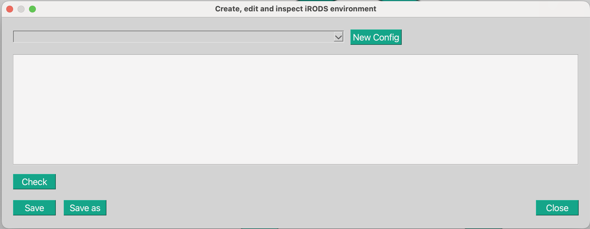
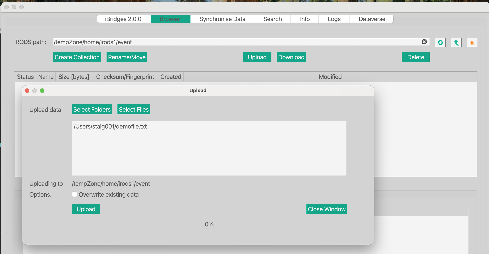

# iBridges GUI Tutorial

## Install and start the GUI

```
pip install ibridgesgui
ibridges gui
```

## Configuration

Create a new *irods_environment.json*. Click on *Configure* in the top menu and choose *Add Configuration*.


Click the green button *New Config*, delete all the text in there and paste the following text:

```
{
    "irods_default_resource": "trainingResc",
    "irods_home": "/tempZone/home/irodsX",
    "irods_host": "irodsserver.researchcloudde.src.surf-hosted.nl",
    "irods_port": 1247,
    "irods_user_name": "irodsX",
    "irods_zone_name": "tempZone"
}
```

Replace `irodsX` with the name we gave you and save the file with *Save as*.
Close the window and click on *Connect* in the top menu. Select your irods environment file and type in the password we gave you.

In the next steps we will take you through the Browser view, explore with you the Data Object and Collections and we will demonstrate a data policy which does something with our data.

## Upload

### Upload a file


In the Upload dialog you can select folders or files to be uploaded to iRODS. For now let us just upload a file. After the upload close the window and click once on you uploaded file.

## Metadata

You will see a change in the metadata tab below the list of files and folders. It tells us that there is no metadata for this file, so let's create some:


You can add a key, value and optionally also a unit, if it makes sense to your metadata.
Click on *Add*. Of course we can change and delete this metadata.

On thing to keep in mind with iRODS metadata is that you can have several entries with the same keys:


The key can be the same but there needs to be at least a difference in the value or unit. If we try to create exactly the same metadata triple again, iBridges will complain.


## Preview
Click on the second of the lower tabs. If you uploaded a `txt`, `json` or `csv` file, you will see the first characters being printed in the screen. We will explore later in the API tutorial how we can read data from iRODS without downloading it. 

## Permissions
The next tab, is the permissions tab.
Here you see who has access to your file:


At the moment you have `own`rights. That means you are allowed to do anything with the data object. 
There are also other access levels: `read`, `write` and of course rights can be retracted by choosing `delete`. Note, that the `write` access level means that you can be changed but not deleted or shared. Only people with access level own, can do so.

To prevent you from locking yourself out of your own data, in iBridges you cannot change your own permissions. Try it! Try to give yourself only `read` rights.

In the API tutorial we will show you how to give access to data and we will share data with each other.

You will also see that the person who uploaded the data will be known as the owner of the data. However that does NOT mean, that you have the rights to do something with the data, We will see that when explore the data policy which is installed on this iRODS server.

## Replicas

The last part that belongs to a data object is the storage. In the *replicas* you can see how many copies of the file you uploaded you have under this path and on which storage they lie. Here it is relatively plain, we have one storage system called `TrainingResc`.

There are iRODS systems that copy the file (not the data object) to another storage system and your data object would have two files under the same iRODS path. The status then shows you whether those data files on the two storage systems are synchronised or not.

**So you can have one data object which consists of one metadata blobb and two files!** 


## The data policy

Let's explore which kind of data policy is installed on this little iRODS instance.
Click on the button *Create Collection* and create the collection with the name `event`.
Double click on the new collection to go into that collection and upload a small file.



Inspect the metadata and the permissions. What do you see and which effect does it have?


## Take aways

- We can annotate data with metadata.
- We can open our data to other users of the same iRODS instance.
- When we use iBridges as client, we cannot lock ourselves out of our own data
- The iRODS server executes policies which we have to be aware of **before** we start working with it.
