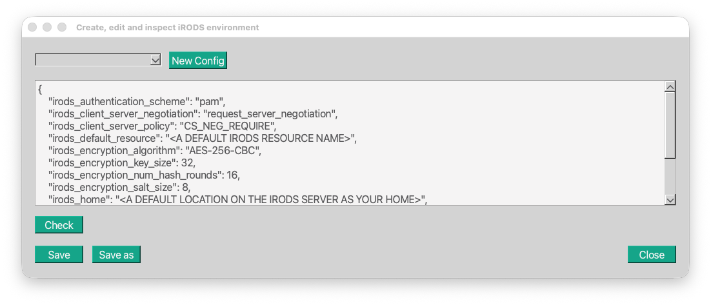
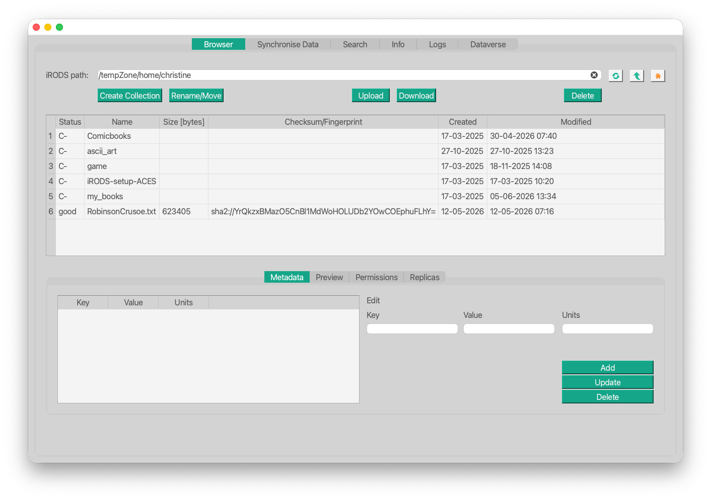
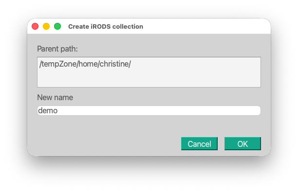
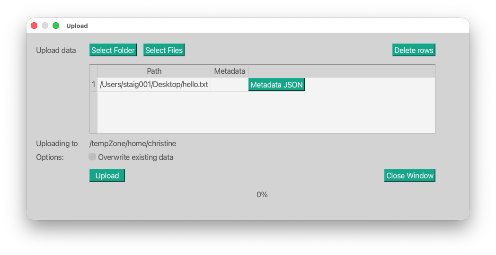
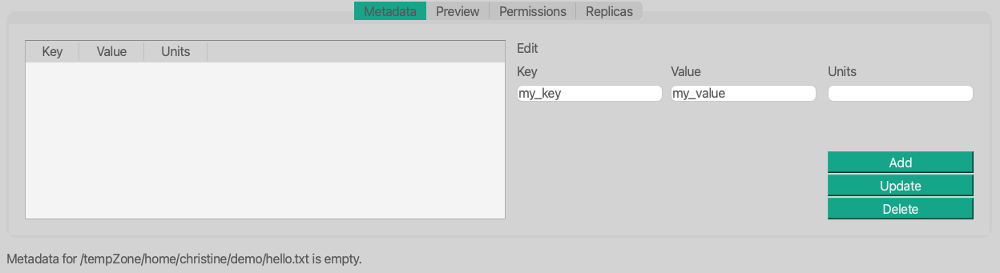
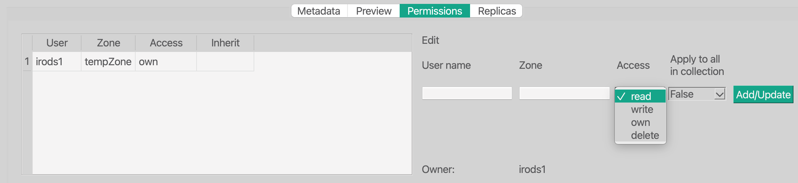

Here is a **clearer, more polished, more structured** version of your text, keeping your meaning but improving readability, flow, and correctness. I also make it work well with a Quarto page TOC (headings tightened, sections structured).

---

# The iBridges Graphical User Interface (GUI)

Please start the iBridges GUI with:

```
ibridges gui
```

Before we can work with data in iRODS, we need to connect to an iRODS server.  
This server manages all data, metadata, user information, and the underlying storage systems.

Let’s walk through how to configure and log in to such a server.

---

## Configuration

To connect to an iRODS server, you need an *environment file*.  
This file defines all parameters required to establish a secure connection and authenticate you as a user.

The environment file is usually named `irods_environment.json` and stored in your home directory inside the hidden folder `.irods`.

Typical home directory locations:

- Windows: `C:\Users\<username>`
- macOS: `/Users/<username>`
- Linux: `/home/<username>`

The iBridges GUI and CLI help you create and store this configuration in the correct location.

## Creating a Configuration in the GUI

Open the main menu **Configure** and select **Add Configuration**.  
A pop‑up window appears with:

- A drop‑down menu listing previously stored environment files  
- A green **New Config** button to create a new file  
- A green **Check** button to validate a configuration  
- The buttons **Save**, **Save As**, and **Close**



When you click **New Config**, the text field is filled with default parameters.  
You can edit these directly. In most cases, only a few parameters need to be changed.

For this training, we use a simplified configuration.  
Please delete all existing content and paste the parameter set we provided earlier.

We will now give you a username to insert into the configuration:

```
{
    "irods_default_resource": "trainingResc",
    "irods_home": "/tempZone/home/irodsX",
    "irods_host": "irodsserver.researchcloudde.src.surf-hosted.nl",
    "irods_port": 1247,
    "irods_user_name": "<USERNAME>",
    "irods_zone_name": "tempZone"
}
```

After editing the configuration, click **Save As** and choose a name for the file.  
You do not need to add an extension — the iBridges GUI automatically saves it as JSON.

This configuration file can be used by all iBridges tools (API, GUI, CLI) and also by the standard iRODS tools, the *icommands*.

## Login and first view

Since we have now a configuration file we can login to the iRODS server. From the main menu click on **Connect** and then **Connect to iRODS**. This opens a new pop-up window with a drop-down menu containing your confiigurations and a password field. If you already logged in to an iRODS server the password field will already be populated and you do not need to type in your password again.

Select the environment we set up, type in your password and hit **Connect**. This will open the application and take you to the *Browser*.



## The Browser

The Browser is one of the most complex views in the iBridges GUI. It combines a view like a file-folder table as you know it from your file explorer with all aspects of the iRODS data objects and collections. Let's walk through it.

On the top you have a navigation bar. You can type in an iRODS path or you can use the three buttons: **Refresh**, **Up Arrow** and the **Home** to navigate through iRODS collections.

The browser starts at the home collection you defined in your iRODS environment configuration. At the moment this collection is empty. So let us create a new collection.

Click on the button **Create Collection**. this will open a pop-up window showing under which iRODS path the new collection will be created and it asks you for a *New name*. Let's call our new collection *demo* and hit **Ok**.



### Navigation

To navigate into this new collection, simply double-click on it. We are in the new collection. If we want to move back to our home, we have two options. As we are only on level below the home, we can use the **Up Arrow** to navigate back. Let's do that.

What happens if we click the **Up Arrow** again? And again ...

At some point we will reach the so-called root collection and cannot move up further. 

To navigate back to our home, we could now follow the whole path back. The shortcut for that is the little **Home** button. 

The last of the three navigation button, is the refresh button. This button becomes especially important when several persons work on the same collection and even data objects. It refreshes all of the information, i.e. new objects and collections, metadata etc. of the path in the navigation bar.

### Buttons and other elements

The browser also shows a row of buttons of which we already tried the **Create Collection** button. Next to that it shows a panel below which shows the metadata, permissions and replicas. 

We will now walk through those one by one.


## Upload

### Upload a file

The first thing you usually want to do is uploading files and folders. So let us create a file on our computer and upload it. Please open a text editor like Notepad, TextPad or TextEdit and write a little "Hello iRODS World!" note. Please make sure that the file is saved as plain text, not RTF. 
In TextEdit you need to press `Shift + Command + T`. Please check in your text editor if you can set the format with the **save as** button.

To find this file easily please store it on your Desktop.

Now let's navigate into our *demo* collection hit the **Upload** button, Click **Select Files** and select your text file.



Each file or folder we want to upload will be listed in the table. You can also remove a file or folder again from the upload list with the **Delete rows** button. All selected rows will be deleted.

Each row will show an own button **Metadata JSON** with which you can automatically add metadata to files and whole folders in iRODS. We will inspect that later. For now hit the **Upload** button and after the transfer finished close the window.

The data object containg the file is now listed in our *demo* collection, the object carries a checksum, which is the checksum of the file. We also see the status *good*, which means all replicas (here just on file) have been checked and are consistent. 

### Exercise

Upload the same file again to the same *demo* collection. What happens? How can we update already existing data?

Why is the data object  different from the file we uploaded? The simplest answer is **Metadata**.

## Metadata

When you select the *hello.txt* in the table, the **Metadata View** will tell you that there is no metadata for the object in iRODS. Let's create some.

Metadata in iRODS is provided as Key-Value-Units triple. With the text fields on the right you cann add them. The Key and Value are always mandatory, you can optionally also set the Units. Click **Add**.



When you now click on the newly created metadata, it will load in the text fields and you can edit the content again. If you click **Add**, a new metadata entry will be created, when you click **Update** the previous metadata will be replaced with the new content.

Why does a change in a Key-Value-Unit triple not always lead to an update? That is special for iRODS. In iRODS each triple only needs to be unique, you can have metadata triples with the same key and even the same value if the Units differ. This can be very confusing.

Metadata can be used to find data when you are not sure where it is saved. that is especially handy for shared data. In the exercises we will explore that.

### Exercises

Create two more metadata entries with the Key-Value-Units:
- type, test_file
- type, ascii

- What happens if you try now to update the key of the second one to "format"?
- What happens if you try to add and already existing metadata entry?
- Navigate to the Search tab and try to find your data by their metadata key. Only fill in the key you would like to search for.
- What happens if you use `%key` as metadata key in the search mask? 
- And what if you changed the `Search in` path to `/tempZone/home/` and you search for the key `auth%`? Double-click on one of the results and go back to your browser. What has changed?

## Download data and metadata

We have now a data object which contains more than just a file. How can we download all of the information?

Select the data object and click on the **Download** button.

With **Open Folders** you can select the donwload location, choose your Downloads folder. In the options we see that we can also download the metadata as json formatted file. Let us try this out and tick the box.

Again hit the **Download** button and close the window after the transfer finished.

Now let us take a look at the metadata file.

```
{
    "ibridges_metadata_version": "1.0",
    "recursive": true,
    "root_path": "/tempZone/home/christine/demo",
    "items": [
        {
            "rel_path": "hello.txt",
            "type": "data object",
            "name": "hello.txt",
            "irods_id": 16149,
            "checksum": "sha2:WkBeh8A/Rnms+tfwWIZppqiVmJpEfijAhzRB/2vCpK0=",
            "metadata": [
                [
                    "my_key",
                    "my_value",
                    ""
                ],
                [
                    "type",
                    "ascii",
                    ""
                ],
                [
                    "type",
                    "bla",
                    ""
                ]
            ]
        }
    ]
}
```

The metadata file first mentions the version of the metadata schema `"ibridges_metadata_version": "1.0"`.
The `root_path` is the parent collection of all of the `items`. You also see that some system metadata was added like the checksum and file size. The most important part for you is the metadata, you can clearly see how it is listed. This is also the current format for automatically uploading data with their metadata.

## Preview
Click on the second of the lower tabs. If you uploaded a file in ascii, i.e. plain text format like txt, csf, tsv, you will see the first characters being printed in the screen. 

## Permissions
iRODS uses Permissions to share data among users. Click on the Permission tab. 



At the moment you have `own`rights. That means you are allowed to do anything with the data object. 
There are also other access levels: `read`, `write` and of course rights can be retracted by choosing `delete`. Note, that the `write` access level means that you can overwrite the data and metadata but you are not aloowed to delete or share. Only people with access level own, can do so.

To prevent you from locking yourself out of your own data, in iBridges you cannot change your own permissions. Try it! Try to give yourself only `read` rights.

In the API tutorial we will show you how to give access to data and we will share data with each other.

You will also see that the person who uploaded the data will be known as the owner of the data. However that does NOT mean, that you have the rights to do something with the data, We will see that when explore the data policy which is installed on this iRODS server.

## Replicas

The last part that belongs to a data object is the storage. In the *replicas* you can see how many copies of the file you uploaded you have under this path and on which storage they lie. Here it is relatively plain, we have one storage system called `TrainingResc`.

There are iRODS systems that copy the file (not the data object) to another storage system and your data object would have two files under the same iRODS path. The status then shows you whether those data files on the two storage systems are synchronised or not.

> **You can have one data object which consists of one metadata blobb and two files!** 


## iRODS as Policy engine

So far we have seen the basics and manual aspects of Data Management. In iRODS a lot of things can be automatised. We will see two examples:

- Transferring rights to a data steward
- Automatically adding metadata to a specific kind of data objects upon upload

These automatic things are called policies or iRODS rules. They can be carried out periodically or by an action, e.g. when you upload a file to a certain collection or by metadata tags.

Let's explore which kind of data policy is installed on this little iRODS instance.
Click on the button *Create Collection* and create the collection with the name `event`.
Double click on the new collection to go into that collection and upload your `hello.txt`

Inspect the metadata and the permissions. What do you see and which effect does it have?

The irods server automatically labels the data with some metadata, here `ibridges:acPostProcForPut` and it transfers the ownership rights to the group `datastewards`. Note that this only happens in this iRODS instance. Other instances will have different automatic and periodical policies.


## Take aways

- We can annotate data with metadata.
- We can open our data to other users.
- We can find data by their metadata.
- The iRODS server executes policies which we have to be aware of **before** we start working with it.
