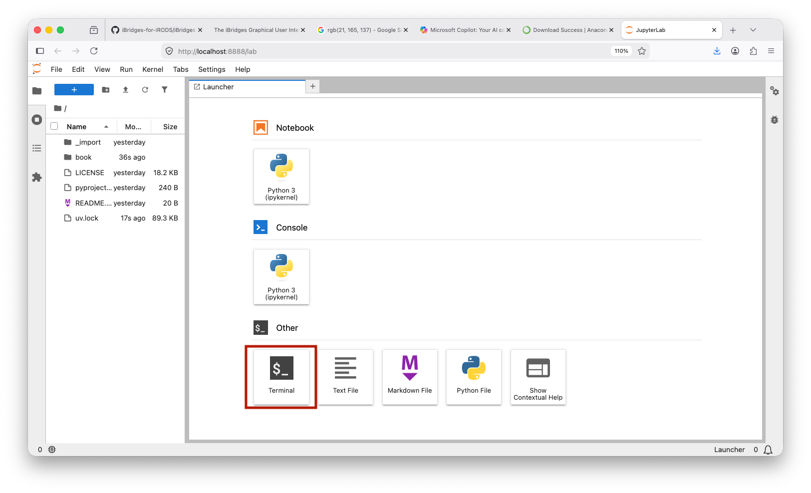

This chapter explains how to prepare your system for working with iBridges, iBridgesGUI and iBridges UU Servers.  
The course is designed for researchers with little or no experience with Python.  
To make installation simple and reliable, we recommend using the free version of Anaconda.


## Why Anaconda

Anaconda provides a beginner friendly Python setup.  
It includes a stable Python interpreter, a package manager called conda, an environment system that keeps tools isolated, and a graphical launcher.  
For new researchers this reduces installation problems and makes working with tools like iBridges and iBridgesGUI much easier.

## Step 1: Install Anaconda

### Download Anaconda  
Please download the "Anaconda Distribution" from the [official Anaconda site](https://www.anaconda.com/download/success?reg=skipped)

### Run the installer  
Accept the default settings.  
On Windows, allow Anaconda to register itself as the default Python.  
If the installer asks whether it should add Anaconda to your PATH, you can accept this option.

## Step 2: Working with Anaconda Navigator and Jupyter

For this course you will use the default environment that Anaconda creates automatically.  
All installation steps will be performed through Anaconda Navigator and the shell that is available inside Jupyter.

### Open Anaconda Navigator  
Start the Anaconda Navigator application.  
In the main window you will see several applications that can be launched, including Jupyter Notebook and the Terminal.

Open the Terminal to install iBridges and the iBridges  GUI.



## Step 3: Install iBridges

In the terminal type

```
pip install ibridges
```

This installs the iBridges API and Commalnd Line Interface.

Test the installation by typing

```
ibridges --help
```

You should see the version and the help menu of the commandline interface:

```
iBridges CLI version 2.1.1

Usage: ibridges [subcommand] [options]

ibridges commands (v2.1.1):
    ls (list, l):
        List a collection on iRODS.
    pwd:
        Show current working collection.
    tree:
        Show collection/directory tree.
        
...
```

## Step 4: Install iBridges GUI

Install the graphical interface

```
pip install ibridgesgui
```

Start the GUI with

```
ibridges gui
```

This opens a desktop application that allows you to work with iRODS and metadata without writing Python code.


## Step 5: Install iBridges UU Servers

Install the Utrecht University server profiles and workflow helpers

```
pip install ibridges-uu-servers
```

After installation, the GUI will automatically detect UU server profiles and make them available in the connection menu.
