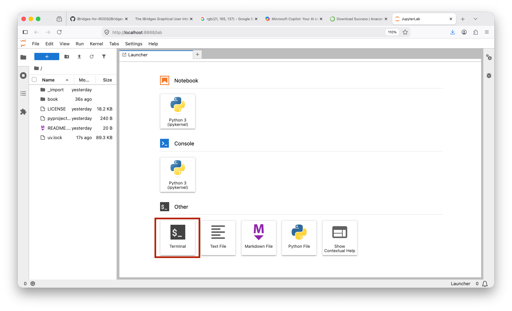

This chapter explains how to prepare your computer for working with **iBridges**, **iBridges GUI** and the **iBridges UU Servers** package.
The course is designed for researchers with little or no experience with Python.
If you can copy and paste a line of text, you can do this.

::: {.callout-note}
## What you will have at the end
- `ibridges`: a command line tool and Python library to work with iRODS
- `ibridgesgui`: a desktop application to browse data and metadata with your mouse
- (Optional) the Utrecht University server profiles and workflow helpers
:::

## Before you start

You need:

- A computer running Windows, macOS or Linux
- An internet connection
- About 10 to 15 minutes
- **Python 3.9 or newer.** iBridges and iBridges GUI do not work with older versions. Step 1 explains how to get Python, and Step 2 shows how to check your version.

## Step 1: Choose your Python setup

iBridges is a Python program, so you need Python on your computer. Pick **one** of the options below.

| Option | Best for | Effort |
|---|---|---|
| **A. Anaconda** | Beginners with no Python experience | Easiest |
| **B. Standard Python** (python.org) | People who want a lightweight, "real" Python setup | Medium |
| **C. I already have Python** | Existing Python users | Quick check |

::: {.callout-tip}
## Which one should I pick?
If you have never installed Python before, choose **Option A**. Anaconda includes a stable Python, a package manager, and a graphical launcher, which reduces installation problems.
If you already know what a virtual environment is, or prefer a minimal setup, choose **Option B** or **C**.
:::

### Option A: Anaconda (recommended for beginners)

#### Download Anaconda

Download the **Anaconda Distribution** (the free version) from the [official Anaconda site](https://www.anaconda.com/download/success?reg=skipped).

#### Run the installer

1. Start the installer and accept the default settings.
2. On Windows, allow Anaconda to register itself as the default Python.
3. If the installer asks whether it should add Anaconda to your PATH, you can accept this option.

#### Open a terminal

A terminal is a window where you type commands. With Anaconda there are two easy ways to open one:

- Open **Anaconda Navigator** from your Start menu (Windows) or Applications folder (macOS), then start the **Terminal** from the main window.
- **Windows alternative:** open the Start menu and search for **Anaconda Prompt**. It does the same thing.



Then continue with [Step 2](#step-2-check-your-python).

### Option B: Standard Python from python.org

1. Download the latest Python 3 release from [python.org/downloads](https://www.python.org/downloads/).
2. Run the installer.
   - **Windows:** if you see the option **"Add python.exe to PATH"**, tick it. This avoids most problems later.
   - **macOS:** use the installer package from python.org.
   - **Linux:** Python is usually already installed. If not, install it with your package manager, for example `sudo apt install python3 python3-pip python3-venv` on Ubuntu or Debian.
3. Open a terminal:
   - **Windows:** search for **PowerShell** or **Command Prompt** in the Start menu.
   - **macOS:** open **Terminal** from Applications > Utilities.
   - **Linux:** open your terminal application.

### Option C: I already have Python

Great. Open a terminal and continue with Step 2.

## Step 2: Check your Python

In your terminal, type:

::: {.panel-tabset}
## Windows
```
py --version
```
## macOS / Linux
```
python3 --version
```
## Anaconda
```
python --version
```
:::

You should see something like `Python 3.12.4`.

::: {.callout-warning}
## Version lower than 3.9, or an error?
iBridges needs **Python 3.9 or newer**. If you see an older version or an error, go back to Step 1 and install a newer Python.
:::

::: {.callout-note}
**Command names differ per system.** On Windows the command is usually `py` or `python`. On macOS and Linux it is usually `python3` and `pip3`. The rest of this chapter uses `python`. Replace it with the name that works on your system.
:::

## Step 3: Create a virtual environment (recommended for Options B and C)

A **virtual environment** is a private folder where iBridges and its dependencies are installed. It keeps iBridges separate from other Python projects, so nothing breaks when you install or update things later. It also avoids permission errors and most PATH problems.

**Anaconda users can skip this step.** Anaconda already keeps its tools isolated, and this course uses the default Anaconda environment.

Create the environment once:

::: {.panel-tabset}
## Windows
```
py -m venv ibridges-env
```
## macOS / Linux
```
python3 -m venv ibridges-env
```
:::

Then **activate** it:

::: {.panel-tabset}
## Windows (PowerShell)
```
ibridges-env\Scripts\Activate.ps1
```
## Windows (Command Prompt)
```
ibridges-env\Scripts\activate.bat
```
## macOS / Linux
```
source ibridges-env/bin/activate
```
:::

When it works, your prompt starts with `(ibridges-env)`.

::: {.callout-important}
You must **activate the environment every time you open a new terminal** before using iBridges.
:::

::: {.callout-tip}
**PowerShell says "running scripts is disabled"?** Run this once and try again:

`Set-ExecutionPolicy -Scope CurrentUser RemoteSigned`
:::

## Step 4: Install iBridges

In the terminal, type the following line and press **Enter**:

```
python -m pip install ibridges
```

You will see text scrolling by while things download. Wait until you see your cursor again. This is normal.

::: {.callout-note}
Using `python -m pip` instead of plain `pip` guarantees that the package is installed into the Python you just checked. Plain `pip install ibridges` works too in most setups.
:::

This installs the iBridges API (for use in Python) and the Command Line Interface.

### Check that it worked

Type:

```
ibridges --help
```

You should see the version and the help menu of the command line interface:

```
iBridges CLI version 2.1.1

Usage: ibridges [subcommand] [options]

ibridges commands (v2.1.1):
    ls (list, l):
        List a collection on iRODS.
    pwd:
        Show current working collection.
    tree:
        Show collection/directory tree.

...
```

Your version number may be different. That is fine.

::: {.callout-warning}
## Seeing "command not found" or "not recognized"?
Your computer cannot find the `ibridges` program. See [Troubleshooting](#troubleshooting) at the bottom of this page.
:::

## Step 5: Install iBridges GUI

The graphical interface lets you work with iRODS data and metadata without writing Python code.

```
python -m pip install ibridgesgui
```

Start it with:

```
ibridges gui
```

A desktop window should open. If it does, you are ready to connect to a server.

::: {.callout-note}
**Linux:** on some distributions the GUI needs extra system libraries before a window can open. If you get an error mentioning `xcb` or `Qt`, install the missing libraries with your package manager or ask your system administrator.
:::

## Step 6 (optional): Install iBridges UU Servers

If you work with Utrecht University iRODS servers, install the server profiles and workflow helpers:

```
python -m pip install ibridges-uu-servers
```

After installation, the GUI automatically detects the UU server profiles and makes them available in the connection menu. Restart the GUI if it was still open.

## Coming back later

Each time you want to use iBridges:

1. Open a terminal (Anaconda Prompt or Terminal for Anaconda users).
2. **Activate your environment**, if you created one in Step 3:
   - Windows: `ibridges-env\Scripts\activate`
   - macOS / Linux: `source ibridges-env/bin/activate`
3. Start what you need, for example `ibridges gui`.

## Updating iBridges

To get the newest versions, run:

```
python -m pip install --upgrade ibridges ibridgesgui ibridges-uu-servers
```

## Troubleshooting {#troubleshooting}

### "ibridges is not recognized" or "command not found"

- **Using a virtual environment?** Make sure it is activated (your prompt shows `(ibridges-env)`). This fixes the problem in most cases.
- **Not using one?** pip installed the program in a folder that your computer does not search by default. This is most common on **Windows**, where command line programs end up in a `Scripts` folder. On macOS and Linux the folder is usually called `bin`.

Typical Windows locations look like this (your username and Python version will differ):

| Setup | Example location of the command line programs |
|---|---|
| Standard Python (python.org) | `C:\Users\Username\AppData\Local\Python\pythoncore-3.14-64\Scripts` |
| Anaconda | `C:\Users\Username\anaconda3\Scripts` |

The iBridges Python package itself is installed in the neighbouring `Lib\site-packages\ibridges` folder.

To fix it, add the **Scripts** folder to your **PATH**:

1. Press the Windows key and search for **Edit the system environment variables**.
2. Click **Environment Variables**.
3. Under **User variables**, select **Path** and click **Edit**.
4. Click **New** and paste the full path of your `Scripts` folder.
5. Click **OK** on every window, then **close and reopen** your terminal.

A step-by-step guide with screenshots is available [here](https://www.architectryan.com/2018/03/17/add-to-the-path-on-windows-10/).

::: {.callout-tip}
Not sure where your `Scripts` folder is? Run `python -m pip show -f ibridges` in the terminal. The output shows where the package was installed. The `Scripts` folder sits next to the `Lib` folder.
:::

### "Requires a different Python" or "No matching distribution found"

Your Python is probably older than 3.9. Check it as described in Step 2 and install a newer version.

### "externally-managed-environment" error (Linux, and macOS with Homebrew)

Your system Python is protected. Use a virtual environment (Step 3) and the error disappears. Do not use `--break-system-packages`.

### Multiple Pythons installed

If `python` and `pip` point to different installations, the package may end up in the wrong place. Always use `python -m pip install ...`, or use a virtual environment.

### The installation seems stuck

Some packages are large. Give it a few minutes. If nothing happens, close the terminal, open a new one, and try again.

### Still stuck?

Copy the full error message and send it to your support contact, together with your operating system (Windows, macOS or Linux) and the output of `python --version`.
