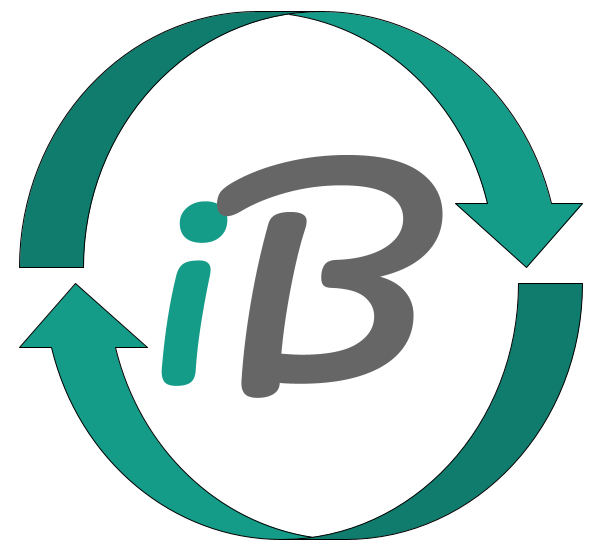
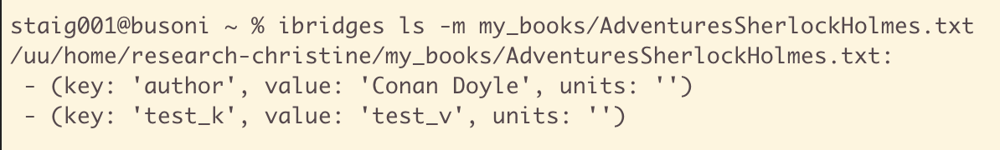
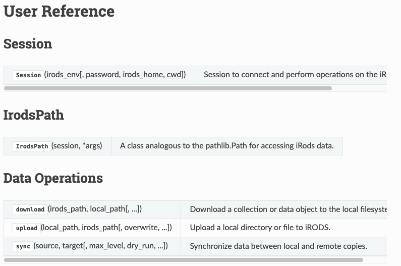
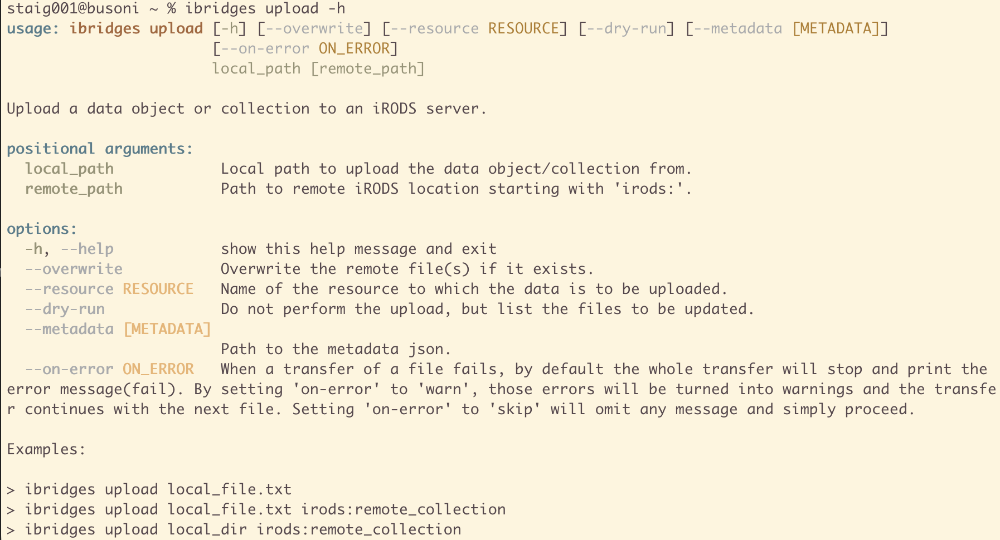
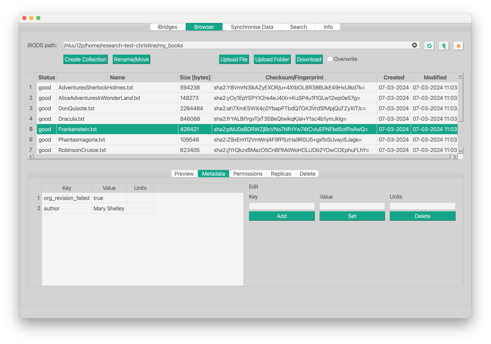

---
format:
  revealjs:
    theme: ../styles/ibridges.scss
    footer: "iBridges Training"
execute:
  enabled: true
---

# Introduction {data-background-color="#d3d3d3"}

## Why this training exists 
- Many research data platforms use iRODS  
- You interact with iRODS when uploading or organising data  
- This training introduces iRODS and iBridges  

## What is iRODS 
:::: {.columns}

::: {.column width="40%"}
**iRODS**: 

- Virtual data layer  
- Unified way to organise and access data  
- Works on top of storage systems
:::

:::{.column width="10%"}
:::

::: {.column width="50%"}
**Difference to normal file systems**: 

- Collections are virtual  
- Data Objects can have multiple replicas  
- Physical storage is hidden  
:::

::::
  
## Virtual view vs physical storage 
:::: {.columns}
::: {.column width="40%"}

- Data in iRODS is virtualised: it lives in storage resources  
- Resources have logical names and physical locations  
- Replicas provide safety and performance  
- You see Data Objects and Collections, tha actual file is stored elsewhere
- iRODS manages storage: you do not need to worry about that.

:::

::: {.column width="60%"}
<div style="text-align: center;">

  <div style="display: inline-block; transform: scale(1.4); transform-origin: top center;">

```{dot}

digraph irods_replication {
    rankdir=TB;

    graph [fontsize=11, fontname="Arial"];
    node  [
        shape=box,
        style=filled,
        color="#15a589",
        fillcolor="#a8e3d7",
        fontsize=11,
        fontname="Arial"
    ];
    edge  [
        fontsize=11,
        fontname="Arial",
        color="#7fbfb5",
        penwidth=1
    ];

    subgraph cluster_zone {
        label="iRODS Zone";
        style=rounded;
        color="#15a589";

        Collection   [label=<Collection<br/><i>/my_project</i>>];
        DataObject   [label=<Data Object<br/><i>report.csv</i>>];

        Collection -> DataObject;
    }

    ResourceA [label="Resource Active\nHost: storage1\nPath: /data/report.csv"];
    ResourceB [label="Resource Archive\nHost: storage2\nPath: /data_backup/report.csv"];

    DataObject -> ResourceA [label="Replica 1"];
    DataObject -> ResourceB [label="Replica 2"];
}
```
  </div>
</div>
:::
::::

## Metadata 

:::: {.columns}

::: {.column width="55%"}
- Metadata describes data  
- Metadata enables discovery  
- Metadata supports automation  




:::

::: {.column width="5%"}
:::

::: {.column width="40%"}
- System metadata  
    - Set by the system  
    - Time stamps, identifiers, checksums  

- User metadata  
    - Used by developers for automation  
    - Used by scientists to annotate data  
:::

:::: 

## iBridges client suite 

- Python API (layer to access (meta)data using Python)
- Command line interface  
- Graphical user interface  

Made for: 

- Researchers  
- Workflow developers  
- Lab technicians  
- Data managers  

## iBridges capabilities 

- Connect to iRODS  
- Upload and download  
- Edit metadata  
- Synchronise folders  
- Create tickets  
- Search metadata  

## Python API 

:::: {.columns}

::: {.column width="40%"}

- Convenience layer around python irods client  
- Creates an irods session automatically  
- Suitable for scripts and workflows  

:::

::: {.column width="10%"}
:::

::: {.column width="50%"}



:::
::::

## Command line interface 

:::: {.columns}

::: {.column width="40%"}

- Simple commands  
- Auto completion  
- No Python code needed  

:::

::: {.column width="60%"}
{scale=150%}
:::
::::

## Graphical user interface 

:::: {.columns}

::: {.column width="40%"}

- Browse collections  
- Upload / Download files and metadata
- Edit metadata  
- Find data by their metadata

:::
::: {.column width="60%"}

:::
::::

## Architecture overview 
:::: {.columns}

::: {.column width="40%"}
- iBridges uses *python-irodsclient* internally   
- CLI and GUI are based on the iBridges API  
:::

::: {.column width="60%"}
<div style="text-align: center;">
  <div style="display: inline-block; transform: scale(1.4); transform-origin: top center;">

```{dot}
//| fig-align: center

digraph ibridges_prc {

    rankdir=TD;   // top-down layout

    graph [fontsize=11, fontname="Arial"];
    node  [
        shape=box,
        style=filled,
        color="#15a589",
        fillcolor="#a8e3d7",
        fontsize=11,
        fontname="Arial"
    ];
    edge [
        fontsize=10,
        fontname="Arial",
        color="#7fbfb5",
        penwidth=1
    ];

    // Cluster for API features
    subgraph cluster_api_features {
        label="iBridges Python API";
        style=rounded;
        color="#15a589";

        Session    [label="iBridges session\ninstantiates irods_session"];
        DataOps    [label="data operations"];
        IrodsPath  [label="IrodsPath"];
        Permissions[label="Permissions"];
    }

    // python irods client
    PRC [label=<<i>python-irodsclient</i><br/>underlying library>];
    CLI [label="Command line interface"];
    GUI [label="Graphical user interface"];
    // Relationships between UI components and API
    CLI -> DataOps [label="calls"];
    GUI -> DataOps [label="calls"];

    // Relationships inside API features
    DataOps   -> Session     [label="uses"];
    IrodsPath -> Session     [label="uses"];
    Permissions -> Session   [label="uses"];

    Session   -> PRC         [label="contains irods_session"];
}
```
  </div>
</div>
:::
::::

# Questions {data-background-color="#d3d3d3"}


